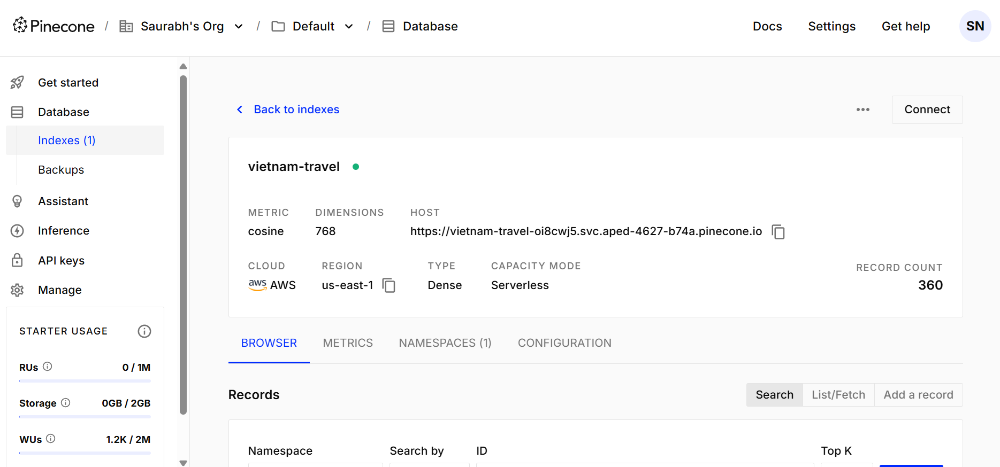
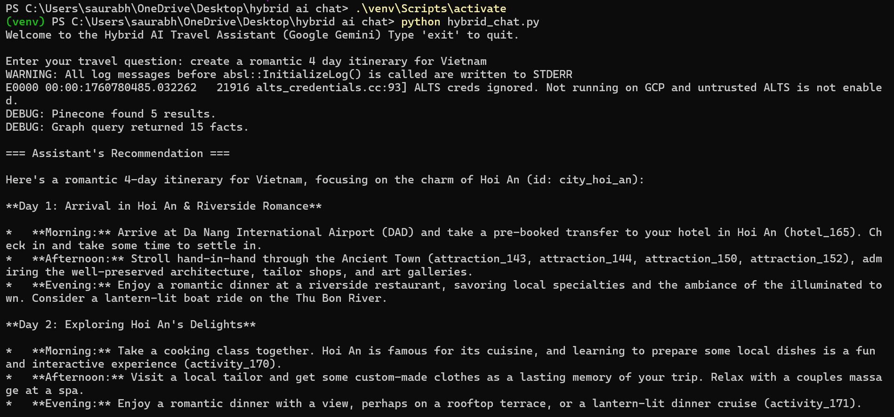

# Evaluation: Hybrid AI Travel Assistant

This repository contains the submission for the Blue Enigma "AI-Hybrid Chat" evaluation. The project is a retrieval-augmented generation (RAG) system that answers travel questions about Vietnam. It leverages a hybrid data retrieval approach, combining semantic search from a vector database (Pinecone) with contextual graph lookups from a graph database (Neo4j), and uses Google's Gemini API for embeddings and intelligent response generation.

For a detailed breakdown of the technical fixes, architectural decisions, and improvements, please see the [**improvements.md**](improvements.md) file.

---

## Final Deliverables

### 1. Working Application Screenshots

#### Pinecone Index Dashboard
*A screenshot confirming the successful upload of 360 vectors with the correct 768 dimension for the Gemini embedding model.*


#### Interactive Chat Session
*A screenshot of the final, working `hybrid_chat.py` script answering the user's query for a "romantic 4 day itinerary for Vietnam" using the full RAG pipeline.*


### 2. Source Code
All required Python scripts are in the root of this repository:
- `hybrid_chat.py`: The main interactive chat application.
- `pinecone_upload.py`: Script to generate embeddings with Gemini and upload to Pinecone.
- `load_to_neo4j.py`: Script to load the travel dataset into a Neo4j graph.
- `visualize_graph.py`: A utility to generate an HTML visualization of the Neo4j graph.
- `config.py.sample`: A template for the required API keys and configuration.

### 3. Improvements Write-up
A detailed explanation of all debugging, completion, and bonus innovation tasks can be found in [**improvements.md**](improvements.md).

---

## Setup and Run Instructions

### Prerequisites
*   Python 3.9+
*   Docker and Docker Compose
*   A Google Gemini API Key
*   A Pinecone API Key

### Step 1: Clone the Repository
```bash
git clone https://github.com/include-saurabh/hybrid-ai-chat.git
cd hybrid-ai-chat
```

### Step 2: Set Up the Environment
1.  **Create and activate a Python virtual environment:**
    ```bash
    python -m venv venv
    # Windows
    .\venv\Scripts\activate
    # macOS/Linux
    source venv/bin/activate
    ```

2.  **Install the required dependencies:**
    ```bash
    pip install -r requirements.txt
    ```

3.  **Configure API Keys:**
    -   Make a copy of `config.py.sample` and name it `config.py`.
    -   Open `config.py` and fill in your **Google API Key** and **Pinecone API Key**.

### Step 3: Start the Neo4j Database
This project uses Docker to run a Neo4j instance. Make sure Docker Desktop is running on your machine.
```bash
docker run \
    --name neo4j-travel \
    -p 7474:7474 -p 7687:7687 \
    -d \
    -e NEO4J_AUTH=neo4j/password \
    neo4j:5.20.0
```
*The Neo4j Browser will be available at `http://localhost:7474`.*

### Step 4: Run the Data Pipeline
Execute the following scripts in order from your terminal.

1.  **Load data into Neo4j:**
    ```bash
    python load_to_neo4j.py
    ```
    *This will populate the Neo4j database with nodes and relationships.*

2.  **Generate embeddings and upload to Pinecone:**
    ```bash
    python pinecone_upload.py
    ```
    *This script will use the Gemini API to create embeddings and upload them. It will automatically create the necessary Pinecone index.*

### Step 5: Start the Chat Assistant
You are now ready to run the interactive RAG assistant.
```bash
python hybrid_chat.py
```
The application will start and prompt you for your travel questions. To test the core functionality, use the example query:
`create a romantic 4 day itinerary for Vietnam`